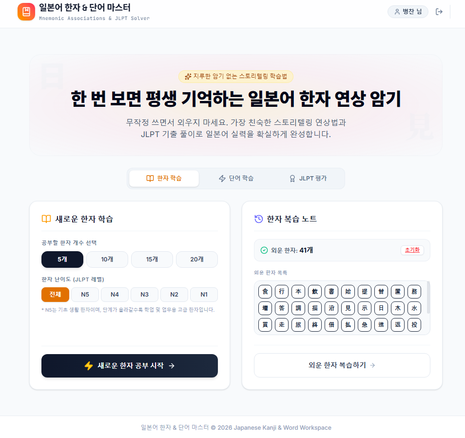
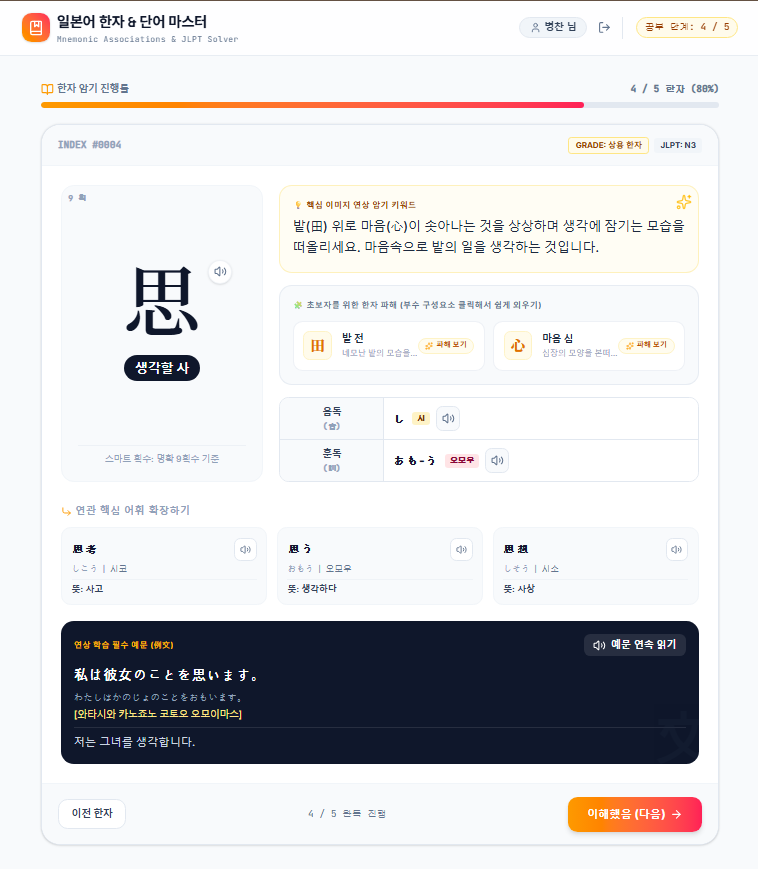
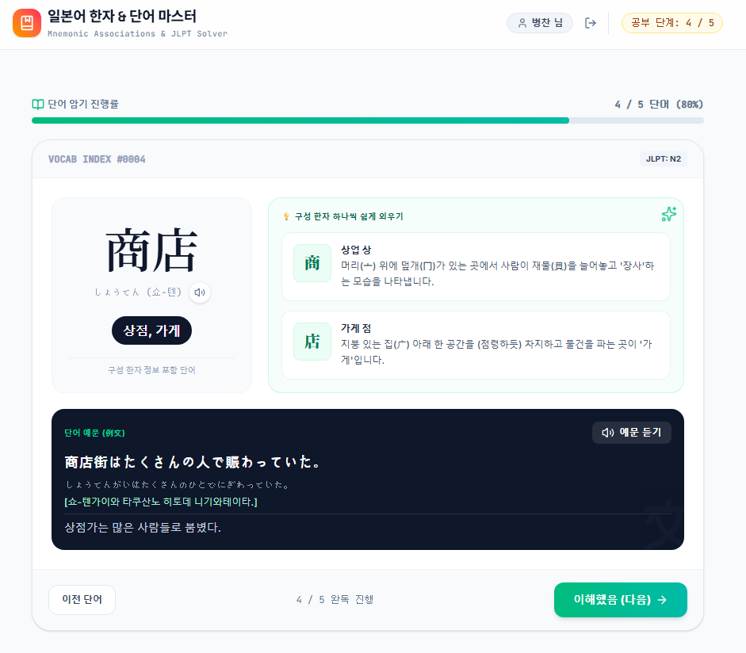
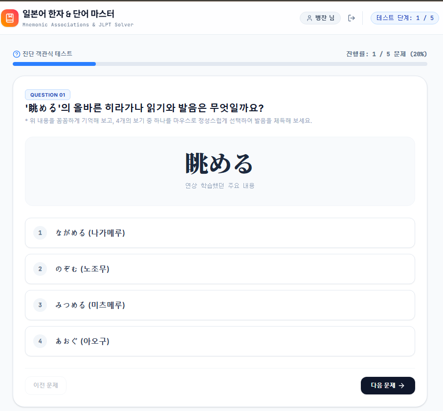

# 🎌 일본어 학습 도우미 (Nihongo Gakushu Helper)

> **Gemini AI와 MongoDB 캐싱을 활용한 스마트 일본어 학습 플랫폼**
> 
> 이 프로젝트는 한국인 학습자가 일본어 한자와 단어를 더 쉽고 효과적으로 학습할 수 있도록 돕는 풀스택 웹 애플리케이션입니다. AI가 실시간으로 학습 수준에 맞는 맞춤형 연상 기억법(Mnemonic)과 퀴즈, 실전 JLPT 모의고사를 생성합니다.

---

## 🛠 실행 방법 (Run Locally)

### 📋 요구 사항 (Prerequisites)
* **Node.js**

### 1. 디펜던시 설치
```bash
npm install
```

### 2. 환경 변수 설정 (`.env`)
프로젝트 루트 디렉토리에 `.env` 파일을 생성하고 아래의 환경 변수들을 알맞게 설정해 주세요.

* **`NODE_ENV`**: 실행 환경 설정 (`development` 혹은 `production`)
* **`GOOGLE_APPLICATION_CREDENTIALS`**: 구글 클라우드(GCP) 서비스 계정 키 파일 경로
  * **로컬 개발 환경**: `"gcp-key.json"`
  * **프로덕션 배포 환경**: `"/etc/secrets/gcp-key.json"`
* **`MONGODB_URI`**: MongoDB 연결 문자열 (MongoDB Atlas에서 Clusters ➡️ Connect 버튼 클릭 후 복사)
  * **프로덕션 환경**: `mongodb+srv://...` 형식 (srv 문자열 사용)
  * **개발 환경**: srv 문자열 체크를 해제한 구버전 드라이버 형식 (`mongodb://...` 포트번호 포함 형태)을 사용합니다.
* **`GCP_PROJECT_ID`**: 구글 클라우드 프로젝트 ID (Project ID)
* **`GCP_LOCATION`**: Vertex AI를 호출할 리전 위치 (예: `us-central1`)

---

### 3. 애플리케이션 실행
```bash
npm run dev
```

---

## 📸 서비스 화면 (Screenshots)

### 🏠 메인 페이지


### ✍ 한자 암기 페이지


### 📖 단어 암기 페이지


### 📝 단어 문제 풀이 페이지


### 📊 결과 리포트 페이지
